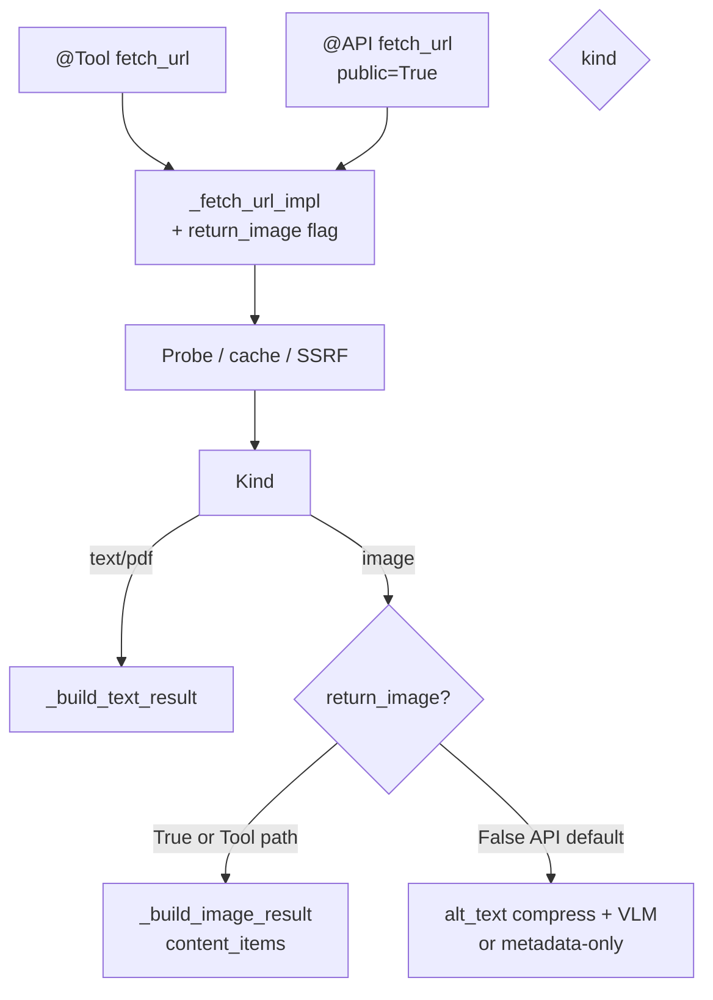

# fetch-url — Inter-plugin `@API` Design Spec

**Date:** 2026-08-01  
**Status:** Approved (brainstorming)  
**Plugin directory:** `maibot-fetch-url-plugin/`  
**Plugin ID:** `com.0-hz.fetch-url`  
**Architecture:** Dual entry (unchanged `@Tool` + new public `@API`), shared `_fetch_url_impl`

## Summary

Expose the existing `fetch_url` fetch pipeline to other plugins via a public `@API("fetch_url")`. Call parameters generally match the Tool. Return shape matches the Tool dict. API results are delivered only as the call return value (no Maisaka context append). For image URLs, the API defaults to a text description via the alt_text / VLM pathway; actual image bytes are returned only when `return_image=True`.

## Problem

Other plugins cannot reuse fetch-url’s SSRF checks, jina/local Markdown conversion, cache, pagination, or summarization without duplicating logic or going through the LLM Tool surface. They need a stable inter-plugin call that mirrors Tool params but returns content to the caller.

## Goals

- Public `@API("fetch_url", version="1", public=True)` callable as `com.0-hz.fetch-url.fetch_url`
- Params align with Tool: `url`, `start_char`, `end_char`, `on_exceed`, `summary_focus`
- API-only param: `return_image: bool = False`
- Return Tool-shaped dict (`success`, `content`, plus existing metadata fields)
- Webpage / PDF path identical to Tool (text in `content`)
- Image + `return_image=False`: describe via alt_text pipeline / VLM; put text in `content`; omit `content_items`
- Image + VLM unavailable/failed: metadata-only text in `content`, `success: True`, no `content_items`
- Image + `return_image=True`: same payload as Tool (`content_items` with base64)
- No Maisaka side effects from the API path
- Leave `@Tool fetch_url` behavior unchanged
- Plugin-only; no Host/SDK source changes

## Non-goals

- Changing Tool defaults (Tool still returns images via `content_items` for Maisaka)
- Forcing page-embedded VLM alt for webpage fetches beyond existing config
- New config schema / `config_version` bump
- Host or SDK patches
- Additional APIs (batch fetch, HEAD-only, raw HTML dump, etc.)

## Decisions (from brainstorming)

| Topic | Choice |
|---|---|
| Return shape | A — same as Tool dict |
| Image default | Text via alt_text / VLM pathway |
| Opt into real image | A — `return_image=False` by default |
| VLM miss on describe | B — metadata-only text, still `success: True` |
| Implementation | 1 — dual entry, shared `_fetch_url_impl` |
| Delivery | Return value only; do not append to Maisaka context |

## Reference

| Source | Patterns reused |
|---|---|
| SDK `@API` / `ctx.api.call` | `maibot-plugin-sdk/docs/guide.md` §API; `docs/zh/plugin/api-components.md` |
| Napcat public APIs | Fully-qualified call name; handler return becomes Host `result`, then SDK `ctx.api.call` unwraps it |
| Existing Tool | `FetchUrlPlugin.fetch_url` + `_fetch_url_impl` / `_build_image_result` / `_build_text_result` |
| Alt-text / VLM | `_prepare_vlm_image_blocking`, `_describe_image_with_vlm`, `AltTextCache` |

---

## Architecture



- Tool entry ignores `return_image` (always image bytes path).
- API entry passes `return_image` into the shared impl.
- Neither API nor Tool calls `maisaka.context.append`; Tool images rely on Host Tool `content_items` handling, which does not apply to `ctx.api.call` returns.

---

## API surface

**Declaration:**

```python
@API("fetch_url", description="抓取 URL 并返回内容（供其他插件调用）", version="1", public=True)
async def api_fetch_url(
    self,
    url: str = "",
    start_char: int = 0,
    end_char: int = -1,
    on_exceed: str = "summarize",
    summary_focus: str = "",
    return_image: bool = False,
    **kwargs: Any,
) -> dict[str, Any]:
    ...
```

**Caller example:**

```python
result = await self.ctx.api.call(
    "com.0-hz.fetch-url.fetch_url",
    url="https://example.com/page",
    start_char=0,
    end_char=-1,
    on_exceed="summarize",
    summary_focus="",
    return_image=False,
)
# SDK unwraps the Host {success, result}; result is the Tool-shaped handler dict
```

### Parameters

| Param | Type | Default | Required | Notes |
|---|---|---|---|---|
| `url` | str | — | yes | http/https only |
| `start_char` | int | `0` | no | Text window start |
| `end_char` | int | `-1` | no | Text window end (`-1` = EOF) |
| `on_exceed` | str | `"summarize"` | no | `summarize` \| `truncate` |
| `summary_focus` | str | `""` | no | Summarize focus hint |
| `return_image` | bool | `False` | no | **API-only.** `True` → image bytes like Tool |

### Return contract (handler body)

Matches Tool:

**Success text:** `success`, `content`, `total_chars`, `returned_range`, `processed`, `provider`, `final_url`, `metadata`, `cached`, …

**Success image (`return_image=True`):** `success`, `content` (notice text), `final_url`, `metadata`, `cached`, `content_items` (base64 image)

**Success image describe (`return_image=False`):** `success`, `content` (VLM description or metadata-only notice), `final_url`, `metadata`, `cached`, `processed` in `{described, metadata_only}` — **no** `content_items`

**Fetch soft failure:** `{success: False, content: "抓取失败：…"}` (same soft style as Tool)

Host wraps a successful handler return as `{success: True, result: <handler dict>}`, but SDK `ctx.api.call`
unwraps `result`; callers receive the handler dict directly. A Host-level failure may instead remain
`{success: False, error: ...}` and has no `content`.

---

## Image describe path (API, `return_image=False`)

1. Reuse probe/download and fetch-result cache (same as Tool image path).
2. Compress with existing alt_text image pipeline (`_prepare_vlm_image_blocking` / `[alt_text.image]`).
3. Lookup `AltTextCache` by content sha256; on hit use cached description.
4. Else call `_describe_image_with_vlm`; on success write cache.
5. Build Tool-shaped success dict with description in `content`, `processed="described"`, no `content_items`.
6. If VLM unavailable or describe fails: build metadata-only `content` (requested URL, final URL, content-type, and format/size/dimensions when known) with an explicit note that description was skipped/failed; `processed="metadata_only"`; `success: True`; no `content_items`.

`return_image=True` reuses `_build_image_result` unchanged.

---

## Versioning & docs

- Bump plugin version to **0.3.0** (new public API surface).
- Update `_manifest.json` description to mention the inter-plugin API.
- No `config_version` / config model changes.
- README: caller section (example, params, image default, Host wrapper note).
- CHANGELOG: 0.3.0 entry.

---

## Testing

Extend `tests/smoke_test.py` (and/or focused unit tests with mocks):

1. API component registered, `public=True`, name `fetch_url`.
2. Image + `return_image=False` + mocked VLM success → description in `content`, no `content_items`, `processed="described"`.
3. Image + `return_image=False` + VLM fail/unavailable → metadata-only, `success: True`, no `content_items`, `processed="metadata_only"`.
4. Image + `return_image=True` → `content_items` present.
5. Text URL path still returns Tool-shaped success fields.
6. Existing Tool smoke coverage still passes (image still uses `content_items`).

Offline smoke: `PYTHONPATH=../maibot-plugin-sdk python tests/smoke_test.py`.

---

## Implementation sketch

1. Import `API` from `maibot_sdk`.
2. Extend `_fetch_url_impl` (and image branch) with `return_image: bool | None = None` where `None` means Tool behavior (always bytes); API passes explicit bool.
3. Add `_build_image_describe_result` (or branch inside image builder) for describe / metadata-only.
4. Add `@API` method that normalizes params and calls `_fetch_url_impl` with the same error mapping as the Tool.
5. Bump version, README, CHANGELOG, tests.

---

## Open questions

None — all brainstorming decisions resolved.
